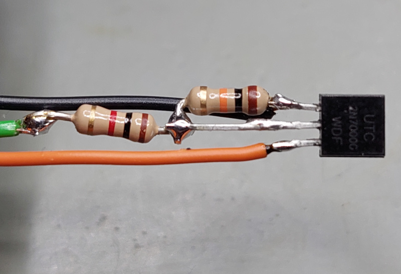

# Modifying (older) A2VGA boards for A2USB
Depending on the version of the A2VGA PCB, you may need to make two hardware modifications to enable A2USB support.
See the main [README](README.md) about which PCBs still require the following modifications, and which don't.

The changes are easy to add:

* Two PICO pins need to be bridged to enable "USB host" support, so the PICO can power a device connected to the USB port: **VBUS** & **VSYS** (pins 39+40):

    

    This can be easily done on the bottom of the A2VGA PCB:

    

* Not required for some simpler applications, but most "sophisticated" programs (like MousePaint, A2Desktop) require IRQ support. Right now, none of the A2VGA cards has an IRQ option. But this can be easily added:

    

    Maybe needless to say, but of course the IRQ jumper needs to be open when using the card with the VGA firmware to provide VGA output. The jumper is only to be closed when using the A2USB firmware, to provide the USB/mouse support.

    I simply rigged an existing PCB to add the two resistors + MOSFET:

    

    
