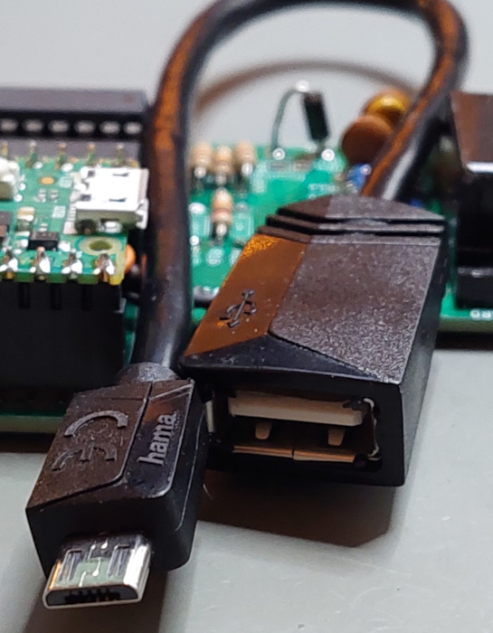
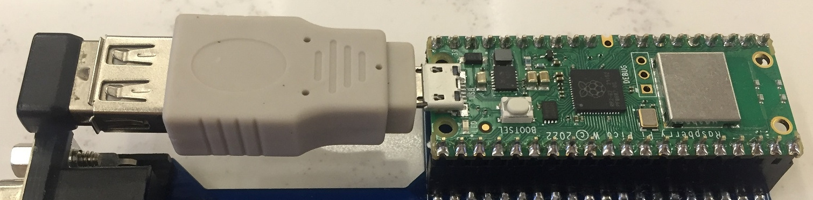
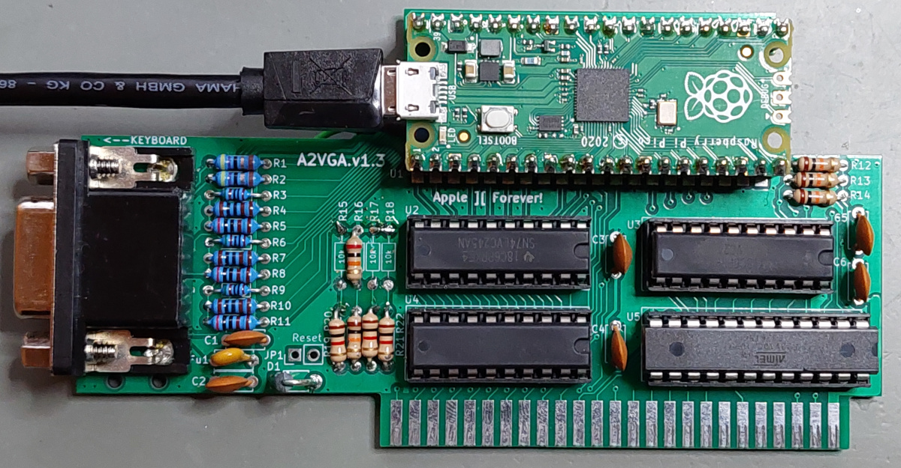
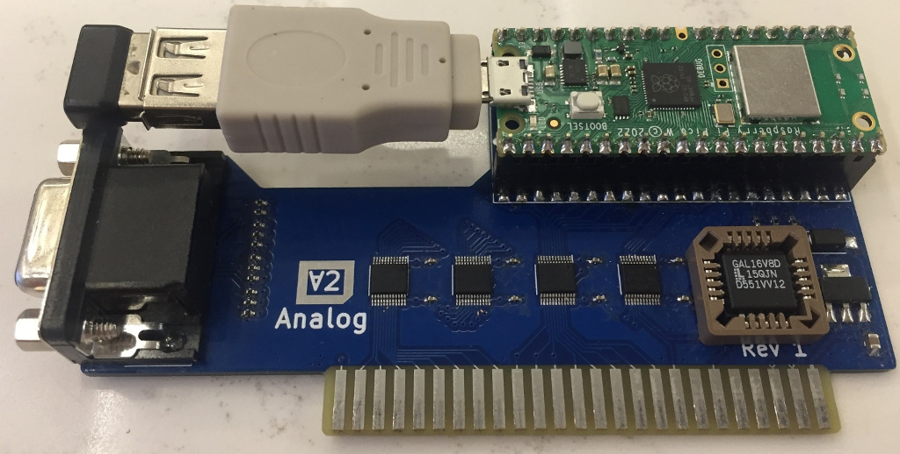

# A2USB: Apple II USB Interface & Apple II Mouse Interface Card

This projects provides alternate firmware for A2VGA cards to support a USB interface instead of VGA output. It currently supports a USB mouse and fully emulates an *Apple II Mouse Interface Card*.

A normal USB mouse can be used with the Apple II. The emulated *Mouse Interface Card* works well with applications like...

* ... **MousePaint**:

    

* ... or **A2Desktop**:

    

... and other similar software.

# Hardware
## Required basics

* You need a simple **MicroUSB to USB-A adpater**, so you can connect a standard USB mouse to the PICO's USB connector.

    * Either use an adapter cable:

        

    * Or a simple plug adapter:

        

* And you need a **standard USB mouse**. Anything conforming to the common "USB HID" standard should work.
* You can also use a **wireless mouse**. Their tiny transceiver plugs also implement a standard USB HID interface.

## Supported PCBs
The following boards can be used to run the A2USB firmware. Some of them require modification:

* [A2VGA PCBs](https://github.com/rallepalaveev/analog) by Ralle Palaveev, using DIP ICs. PCB Rev 1.6 and newer already have the options required for A2USB (see jumper options).
  * His v1.5 PCBs (or older) can also be used, however, they need to be modified to support A2USB. See [modifications](HwModding.md).

     

* David Kuder's [A2analog PCBs](https://github.com/V2RetroComputing/analog) can also be used, but currently also require the [modifications](HwModding.md).

     

* More supported hardware platforms are coming! Watch this spot... :)

# Installation
* Download the latest A2USB firmware ZIP file from the [Releases](https://github.com/ThorstenBr/A2USB/releases) section.
   * ZIP file contains separate firmware for NTSC/PAL regions. Difference is only the default mouse interrupt frequency (PAL 50Hz / NTSC 60Hz).
   * According to Apple II Technical Notes, the original Mouse Interface Card was also shipped with variants for PAL / NTSC, with differing default interrupt rates.
* **Remove the PICO (or entire card) from the Apple II**.
* Connect the PICO's USB to your PC/MAC **while pressing the BOOTSEL button**.
* Drag & drop the A2USB firmware file **A2USB-MOUSE-...-4ns.uf2** from the Releases ZIP archive to your PICO.
* Wait a second.
* Disconnect and reinstall in your Apple II. Route the USB adapter cable through an opening in the back. Connect a USB mouse directly (sorry, no USB HUB support yet).
* **No change to the PAL/CPLD logic is required.**

# Behind the Scenes

## How the original Apple II Mouse Interface Card worked...
The original Apple II Mouse Interface Card was introduced in 1984, shortly after the first Mac was launched. It consisted of a "peripheral interface adapter" (PIA) using an Motorila MC6821. Cards were also made using compatible Rockwell 6520/6521 PIAs. And it came with an MC6805 microcontroller as a slave device.

The microcontroller monitored the mouse buttons and movements and communicated with the Apple II's 6502 through one of the PIA's 8bit ports. It's using a very simple command based protocol: the 6502 sends commands, the slave controller responds with the requested data.

The card also had a 2KB ROM, which was mapped to the slot's 256byte address window. The ROM is split into 8 pages, which are also selected through I/O ports of the PIA. The ROM contains the necessary driver routines to communicate with the 6805 slave controller.

The card also had an option to trigger an interrupt, to notify the 6502. This interrupt could also be configured to be periodic - and synchronous to the vertical screen blanking. This ensured the mouse cursor was only updated during the screen blanking, which avoided flickering when moving the mouse.

### Here's the original Apple II Mouse Interface Card design:

                            +-----------+                                       +--------------+
                         ___|  2KB ROM  |                             __________|Apple II Mouse|
    +------+            /   +-----------+                            /          +--------------+
    | 6502 |___________/         | page selection                 |plug|
    | CPU  |\ Apple    \    +-----------+                  +------+----+-----+
    +------+ \ Bus      \___|    PIA    |__________________|     MC6805      |
              \             |  MC6821   | 8bit + handshake | MicroController |
               \            +-----------+ data             +-----------------+
             IRQ\_______________________________________________/

## How A2USB emulates the Apple II Mouse Card
The A2USB firmware uses the original code from the A2VGA project to interface the 6502 bus. It is based on the PICO's I/O slave units (PIOs), which are extremely fast I/O state machines. They control the PICO's GPIO lines and guarantee that the signals comply with the 6502 bus timing. Once the PIOs detect a 6502 READ or WRITE bus cycle, they pack the bits into a single 32bit message (containing address + data + control bits) and forward the request to the PICO's main ARM CPU.

One of the PICO's ARM cores takes care of processing incomming READ/WRITE messages. Reads are most critical, their result must be ready within about 300ns and returned to the PIOs, so the data is presented on the 6502 data bus. That's not much time. The software for the ARM cores needs to be very quick - less than 100 instruction cycles must be enough to process each message.

A few nanoseconds time have to be enough for the mouse card's ROM emulation. This is easy: the Mouse Interface Card's 2KB ROM is just an array, where we need to look up and return a single byte, whenever the 6502 makes a matching read request.
It just needs to consider the slot ROM address given by the 6502 (8bit offset) and the selected ROM page (depending on the configuration of the virtual PIA).

The same core also takes care of emulating the PIA. This is also easy. The PIA just has a couple of simple data and control registers, which can be read & written.

The PICO's second ARM core runs the "tinyUSB host" library, which interfaces with *USB HID devices* like mice (or keyboards).

The second core also emulates the mouse card's MC6805 microcontroller. This is not done on CPU instruction level, since running the original code wouldn't make much sense. Instead, the software just emulates the original communication protocol. It implements the same commands and provides the same type of responses, as the original MC6805 controller did.
And it talks to the first ARM core through the emulated PIA registers, using shared memory communication.

### This is how the design of the A2USB firmware looks:

                      +----------------------------------------------------------------------------+
                      |                         PICO Micro Controller (RP2040)                     |
     +------+         |     +----------+           +-----------------+        +------------------+ |
     | 6502 |_________|_____| PIO 1+2  |___________|   ARM Core #1   |________|   ARM Core #2    | |
     | CPU  |\ Apple  |GPIO |I/O State |   32bit   | Mouse Card ROM+ | Shared |  USB HID Stack+  | |
     +------+ \ Bus   |Pins | Machines |  Message  |  PIA Emulation  | Memory | MC6805 Emulation | |
               \      |     +----------+   FIFOs   +-----------------+        +--------+---------+ |
             IRQ\_____|_________________________________________________________/   USB|PORT       |
                      +----------------------------------------------------------------|-----------+
                                                                                       |
                                                                                       |  +-----------+
                                                                                        \-| USB MOUSE |
                                                                                          +-----------+ 

# Acknowledgements
This is an alternate firmware project for A2VGA cards to support a USB interface and Apple II Mouse Card emulation, instead of VGA output.

It is based on the A2VGA projects of...

* ... Mark Aikens: [Apple II VGA project](https://github.com/markadev/AppleII-VGA/)
* ... David Kuder: [A2analog project](https://github.com/V2RetroComputing/analog)
* ... and Ralle Palaveev: [A2VGA project](https://github.com/rallepalaveev/analog)

Many thanks for the excellent work, which is a base for the A2USB project!
