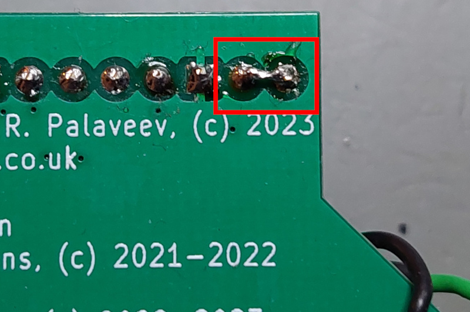

# A2USB: Apple II USB Interface & Apple II Mouse Interface Card

This projects provides alternate firmware for A2VGA cards to support a USB interface instead of VGA output. It currently supports a USB mouse and fully emulates an *Apple II Mouse Interface Card*.

A normal USB mouse can be used with the Apple II. The emulated *Mouse Interface Card* works well with applications like...

**MousePaint**:

or **A2Desktop**:

# Modifications
Currently two modifications need to be made to A2VGA boards, to enable the A2USB support.

Currently, no PCB design is available yet, which includes these changes as an option. But they are easy to add:

* I used this [through-hole PCB design]((https://github.com/rallepalaveev/analog), since this is easier to tinker with.
* Two PICO pins need to be bridged to enable "USB host" support, so the PICO can power a device connected to the USB port: **VBUS** & **VSYS** (pins 39+40):

    

    This can be easily done on the bottom of the A2VGA PCB:

    

* Not required for some simpler applications, but most "sophisticated" programs (like MousePaint, A2Desktop) require IRQ support. Right now, none of the A2VGA cards has an IRQ option. But this can be easily added:

    

    Maybe needless to say, but of course the IRQ jumper needs to be open when using the card with the VGA firmware to provide VGA output. The jumper is only to be closed when using the A2USB firmware, to provide the USB/mouse support.

    I simply rigged an existing PCB to add the two resistors + MOSFET:

    

    

* Hopefully some A2VGA PCB designs will add optional IRQ support (I currently do not plan to start an own PCB fork).

# Installation
* Download the latest A2USB firmware from the [Releases](/Releases) section.
* **Remove the PICO (or entire A2VGA card) from the Apple II** (!)
* Connect the PICO's USB to your PC/MAC **while pressing the BOOTSEL button**.
* Drag & drop the A2USB firmware file **A2-USB-MOUSE-4ns.uf2** from the Releases ZIP archive to your PICO.
* Wait a second.
* Disconnect and reinstall in your Apple II. Route the USB adapter cable through an opening in the back. Connect a USB mouse directly (sorry, no USB HUB support yet).

# Acknowledgements
This is an alternate firmware project for A2VGA cards to support a USB interface instead of VGA output.
It is based on software...

* ... from Mark Aikens' [Apple II VGA project](https://github.com/markadev/AppleII-VGA/), and
* ... from David Kuder's [A2analog project](https://github.com/V2RetroComputing/analog).
* I was using Ralle Palaveev's [PCB design with DIP ICs](https://github.com/rallepalaveev/analog).

Many thanks for the excellent work, which is a base for the A2USB firmware.
